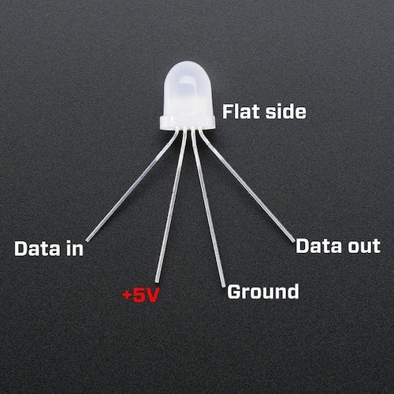
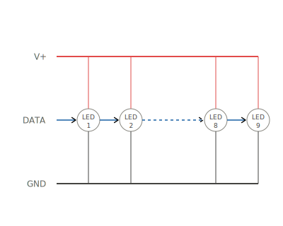

# Building the strip

Build the 9-LED chain first, as a standalone piece. You'll connect it to the Scion and USB power later.

## How a NeoPixel is pinned out

- **DIN** — data in (from the previous LED or the Scion for LED #1)
- **V+** — +5V rail
- **GND** — ground rail
- **DOUT** — data out (to the next LED's DIN)

## How the 9 LEDs connect

- **Power and ground are parallel**: every LED's V+ connects to one shared rail, every GND to another.
- **Data is serial**: each LED's DOUT wires to the next LED's DIN. LED #1 receives from the Scion. LED #9's DOUT is unused.

## Prep your wire

Cut 22 AWG segments, strip ~3mm off each end:

- 8 pieces for V+ between LEDs
- 8 pieces for GND between LEDs
- 8 pieces for data between LEDs
- 3 pieces for the "entry" wires (V+, GND, DATA) that will reach back to the Scion and USB cable

Length and color are up to you, whatever suits your layout.

## Solder the chain

For each LED from #1 to #9:

1. Solder a V+ wire from the previous LED's V+ to this LED's V+
2. Solder a GND wire from the previous LED's GND to this LED's GND
3. Solder a data wire from the previous LED's **DOUT** to this LED's **DIN**

LED #1 is the start: leave its V+, GND, and DIN legs bare for now, you'll attach the long entry wires to them at the end.

After soldering each LED, check your work: no solder bridges, no swapped V+/GND, no DOUT-to-DOUT mistakes. DIN and DOUT are easy to confuse, so keep the pinout photo nearby.

Once the chain is complete, solder the three entry wires to LED #1's V+, GND, and DIN legs.

!!! info "Label your wires"
    If you're using a single wire color, tape labels on each one so you can tell V+, GND, and DATA apart.

## Tape off LED #9's DOUT

LED #9 is the end of the chain. Its DOUT leg is unused. Bend it away from the other legs and cover it with tape or a piece of heat shrink, so it can't touch anything.

## Sanity test the strip

Before connecting to the Scion, use a multimeter in continuity mode to check your soldering:

1. **V+ rail**: probe LED #1 V+ leg to LED #9 V+ leg. Should beep.
2. **GND rail**: probe LED #1 GND leg to LED #9 GND leg. Should beep.
3. **No short**: probe any V+ leg to its neighbor GND leg on the same LED. Should NOT beep.

If the V+ or GND rail doesn't beep, you have a broken joint somewhere along that rail. If the short test beeps, you have solder bridging V+ and GND. Find and fix before moving on.
