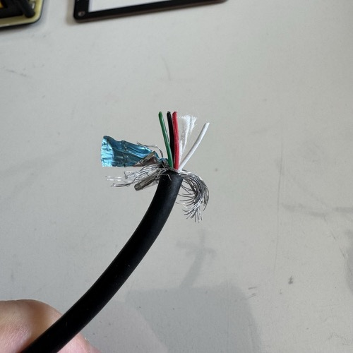
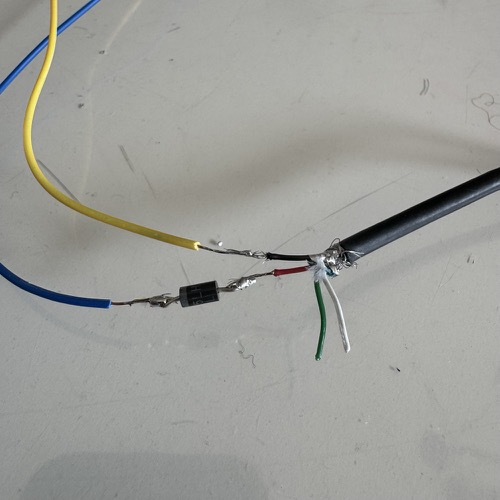

# Powering the strip

Bring the three pieces together: the LED strip, the Scion (DATA already soldered), and a USB-A cable that provides power through an inline diode.

!!! warning "Use USB-A, not USB-C"
    A bare USB-C cable cut open won't deliver 5V. USB-C sources require sync logic (CC pin pull-downs on the sink) before they turn on VBUS. If you want USB-C, see the [breakout board alternative](#alternative-adafruit-usb-c-breakout-board) below.

## Prepare the USB-A power cable

1. Cut the USB-A cable about 30-50cm from the plug. Keep the plug end, discard the rest.
2. Strip ~5cm of the outer jacket from the cut end. Inside you'll find a **red** wire (+5V), a **black** wire (GND), green and white data wires (D+/D-), and a metal shield with filler.
3. Cut everything except the **red** and **black** wires flush with the jacket.



## Solder the diode inline on the RED wire

The diode drops the USB 5V down to ~4.3V, which is what lets the LEDs reliably read the Scion's 3.3V data signal. Without it the strip will flicker or show wrong colors.

1. Cut the red wire in half. Strip ~5mm off both cut ends.
2. The 1N4001 has a **band** on one end (the cathode).
3. Solder the **unbanded end** to the red wire coming from the USB plug.
4. Solder the **banded end** to the red wire going on to the LED strip.

```
USB plug side: RED ───[ unbanded |>| banded ]─── to LED V+
                                     ▲
                        band must face the LEDs
```

!!! warning "Diode orientation matters"
    The banded end (the cathode) must face the LEDs. Backwards, nothing lights up at all.

Cover every exposed joint with electrical tape or heat shrink. No bare metal anywhere.



!!! info "Why a diode?"
    The Pocket Scion outputs data at 3.3V, but NeoPixels powered from 5V want a data signal of at least 3.5V. Your 3.3V signal is just below spec, which causes flickering and wrong colors.

    A 1N4001 diode drops the NeoPixel supply from 5V to about 4.3V. At that voltage, the NeoPixels only need ~3.0V on the data line, which your 3.3V signal easily satisfies. Cheap, simple, done.

    The more "proper" fix is a level shifter chip (like the 74AHCT125) on the data line, but that's an extra component and extra soldering. For this project the diode is enough.

## Connect the USB cable to the LED strip

- **Red wire (after the diode)** → strip's **V+** entry wire
- **Black wire** → strip's **GND** entry wire

Insulate both joints.

### Alternative: Adafruit USB-C breakout board

Use this path if you want USB-C (or just don't want to cut up a cable). The [Adafruit USB Type-C Breakout #4090](https://www.adafruit.com/product/4090) has the CC pin pull-downs built in, so the USB-C source will actually provide 5V. Solder your V+ wire to the board's **VBUS** pad and your GND wire to the **GND** pad, and put the diode inline on the V+ wire exactly as above. A standard USB-C cable then plugs into the board.

## The Power Source Rule

**Both USB cables must plug into the same physical dual-port power source.**

| ✅ OK | ❌ Not OK |
|---|---|
| Dual-port wall charger | Wall charger + power bank |
| Dual-port power bank | Laptop + charger |
| Multi-port USB hub | Two separate chargers on the same outlet |

Different power sources do not share ground, and the data signal from the Scion to the LEDs needs a common ground reference. Getting this wrong is the most common cause of "it worked on the bench, now it flickers."

## Check your work

Before plugging anything in, visually verify the wiring:

- [x] Diode band faces the LED side
- [x] No exposed metal anywhere
- [x] Red → V+, black → GND (not swapped)
- [x] DATA wire goes from Scion to LED #1 DIN only
- [x] LED #9 DOUT is taped off

## Voltage test

Plug **only the LED power cable** (not the Scion yet) into your dual-port source. This step checks the diode before the Scion is in the picture.

1. Multimeter on DC voltage, probes on the LED strip's V+ and GND.
2. You should read **~4.3V** (anywhere between 4.0 and 4.5V is fine).

Any other reading, stop and fix it:

- ~5.0V → diode is missing, shorted, or bypassed
- 0V → diode is backwards or a wire is broken

## Power on

Now plug the Scion in too. Both cables (USB-C for the Scion, the sacrificial cable for the LEDs) must go into the **same** source. The Scion boots, the 9 LEDs animate. If something looks wrong, go to [Troubleshooting](troubleshooting.md).