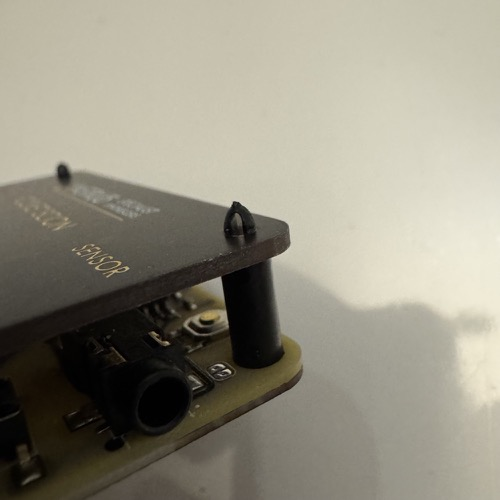
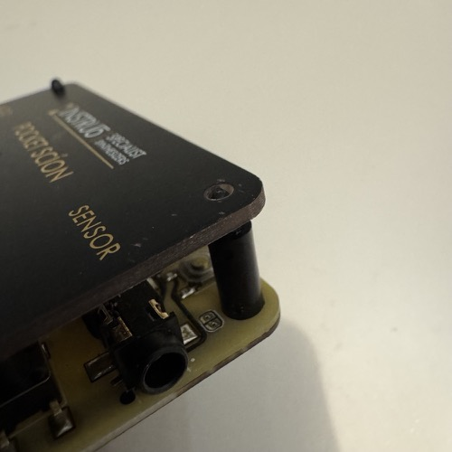
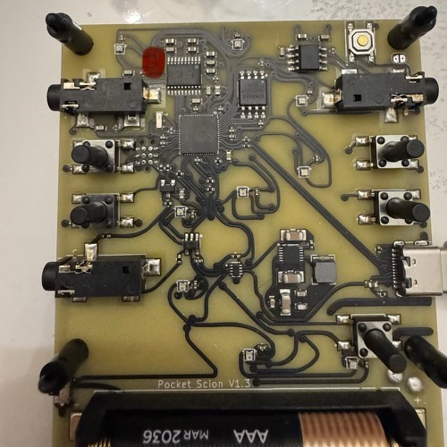
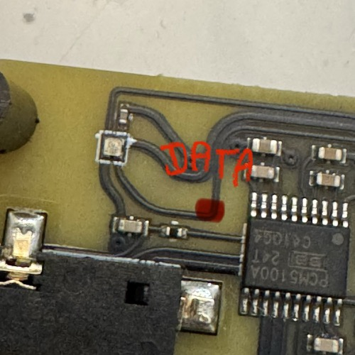
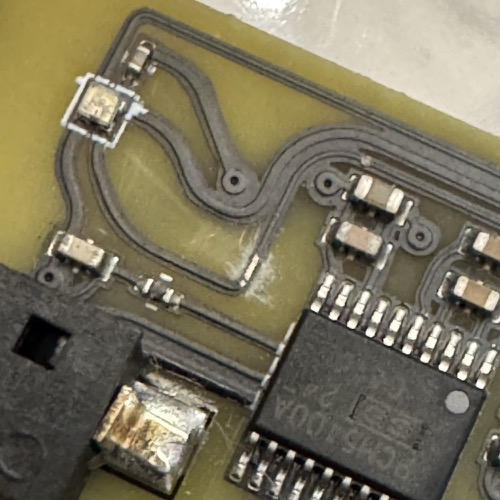
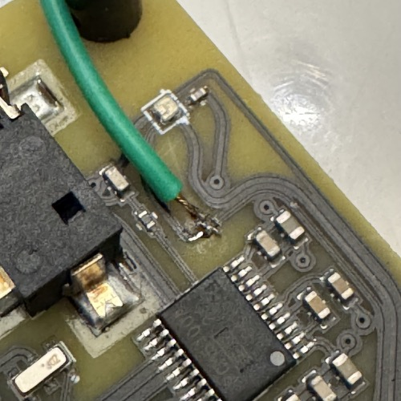

# Tapping the Scion

Expose the NeoPixel data line on the Scion's PCB and solder your strip's DATA wire to it.

## Remove the front plate

The Pocket Scion ships with a front plate held on by 6 plastic standoffs. To get to the data trace, you need to take the plate off. Pinch each standoff with pliers and pull, all 6 of them, then lift the plate off.

## Find the data trace

The trace is covered by black conformal coating. The image below shows where to look on the physical board.

## Scrape the conformal coating

With a small flat-head screwdriver or hobby knife, gently scrape the black coating until bare copper shows. A 2-3mm window is plenty. Scrape lightly — you only want to remove the coating, not cut through the trace.

## Tin the copper and solder the DATA wire

1. Touch the soldering iron to the exposed copper and flow a small bead of solder onto it. Remove the iron quickly.
2. Strip and tin the free end of the DATA entry wire from your LED strip.
3. Press the tinned wire onto the tinned trace, touch the iron to the joint for 1-2 seconds, and let them fuse.

